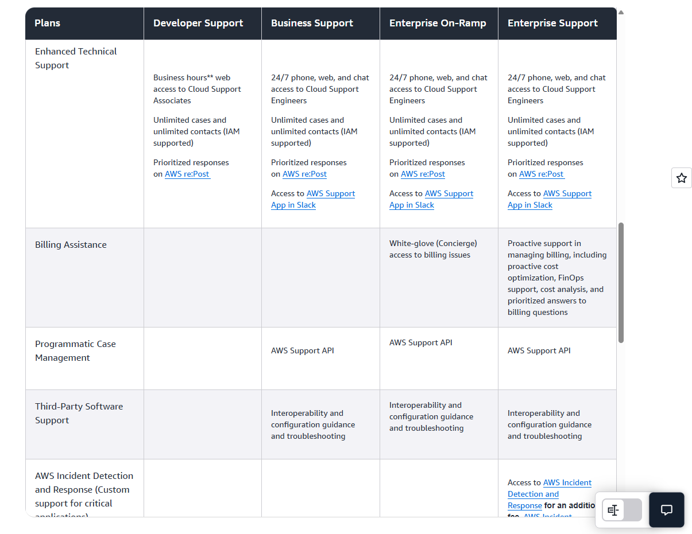

---

### **AWS Support Plans – One-Rhyme Memory Version**

**Basic**
*“Free for all, docs and re:Post call,
Core checks only, no TAM at all.”*

**Developer**
*“Experiment and test, keep less stressed,
<24h general, <12h when system’s distressed,
Core checks stay, no TAM sway, business-hour help lights the way.”*

**Business**
*“Production hums, 4h impaired, 1h if down,
Full checks unlocked, 24/7 support all around,
Slack app, API, automation too — proactive guidance comes for you.”*

**Enterprise On-Ramp**
*“Critical workloads in sight, 30min for business down at night,
Full checks, TAM pool, proactive rule, Countdown once for guidance jewel.”*

**Enterprise**
*“Mission-critical call, 15min response for all,
Full checks + priority recs, TAM designated, deep dives and workshops flex,
Countdown and Concierge billing make support apex.”*

---

✅ **Trick to memorize:**

* **Basic → Developer → Business → Enterprise On-Ramp → Enterprise** → think **“Free, Test, Prod, Critical, Top”**
* Response times shrink as you climb the ladder.
* TAM appears only from **Enterprise On-Ramp** onward.
* Trusted Advisor: **Core → Core → Full → Full → Full + Priority**
* Channels: **Docs → Email → 24/7 → 24/7 + Proactive → 24/7 + TAM Concierge**

---

---

### **AWS Support Plans – Chantable Jingle**

**Basic:**
*"Free for all, docs and re:Post call, core checks only, no TAM at all."*

**Developer:**
*"Test and play, <24 general, <12 impaired day, core checks, no TAM, business-hours way."*

**Business:**
*"Prod workloads hum, <4h impaired, <1h down, full checks, 24/7 support, Slack and API around."*

**Enterprise On-Ramp:**
*"Critical in sight, 30min biz down at night, full checks, TAM pool, Countdown once, proactive rule."*

**Enterprise:**
*"Mission-critical call, 15min response for all, full + priority checks, TAM, workshops, Concierge tall."*

---

✅ **Memorization Tip:**

* Picture a **ladder** from **Basic → Enterprise**, each step faster and more powerful.
* **TAM appears at On-Ramp**, **full + priority checks only at Enterprise**, and **response times shrink** as you climb.
* Chant it aloud like a rhyme-song to **lock it in memory**.

---

# **5 severity levels**:

* Low (`low`) — General guidance
* Normal (`normal`) — System impaired
* High (`high`) — Production system impaired
* Urgent (`urgent`) — Production system down
* Critical (`critical`) — Business‑critical system down

Hi-low Urge critical normal

Case Severity/Response Time
DEV 24 gen 12 impaired
Busines 4 impaired 1 down

Core => Core => Full Checks => Full Checks => Full + Priority Checks

| Feature / Plan                                | **Basic**                       | **Developer**                  | **Business**                                      | **Enterprise**                                      |
| --------------------------------------------- | ------------------------------- | ------------------------------ | ------------------------------------------------- | --------------------------------------------------- |
| **Price**                                     | Free                            | Starting ~$29/month            | Starting ~$100/month                              | Starting ~$15,000/month                             |
| **Target Users**                              | All AWS customers               | Early-stage dev/test workloads | Production workloads                              | Mission-critical workloads                          |
| **24/7 Support**                              | ❌                               | ✅ Email only                   | ✅ Phone, Chat, Email                              | ✅ Phone, Chat, Email                                |
| **Technical Support Response Times**          | N/A                             | < 12–24 hours                  | Critical (1h), High (4h), Normal (12h), Low (24h) | Critical (15min), High (1h), Normal (4h), Low (12h) |
| **AWS Trusted Advisor**                       | Limited checks                  | Service Quota and basic Security checks - Limited checks                 | Full set                                          | Full set                                            |
| **AWS Personal Health Dashboard**             | ✅                               | ✅                              | ✅                                                 | ✅                                                   |
| **Best Practice Guidance**                    | ❌                               | ✅                              | ✅                                                 | ✅                                                   |
| **Proactive Guidance / Architecture Reviews** | ❌                               | ❌                              | Limited                                           | Full (TAM included)                                 |
| **Access to Support Engineers**               | ❌                               | ✅ (business hours)             | ✅ (24/7)                                          | ✅ (24/7)                                            |
| **Technical Account Manager (TAM)**           | ❌                               | ❌                              | ❌                                                 | ✅                                                   |
| **Support Channels**                          | Docs, Forums                    | Email                          | Email, Chat, Phone                                | Email, Chat, Phone                                  |
| **Use Case**                                  | Learning, basic experimentation | Early dev projects. Developer is recommended if you are experimenting or testing in AWS             | Production workloads                              | Mission-critical apps, enterprise-wide adoption     |

#
## Enhanced Technical Support:

### **Developer Support**:
* Unlimited cases and unlimited contacts (IAM supported)
* Business hours** web access to **Cloud Support Associates**

### **Business Support** && **Enterprise On-Ramp** && **Enterprise Support**:

24/7 phone, web, and chat access to **Cloud Support Engineers**

Unlimited cases and unlimited contacts (IAM supported)