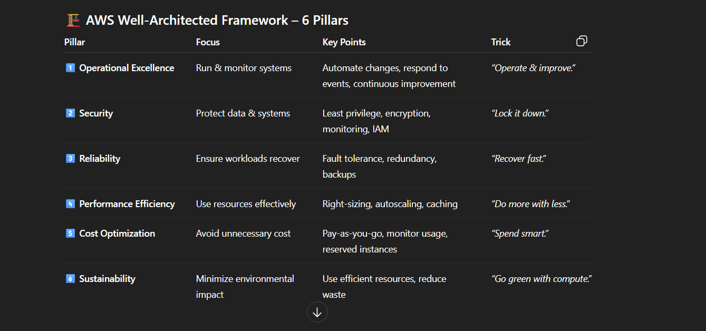
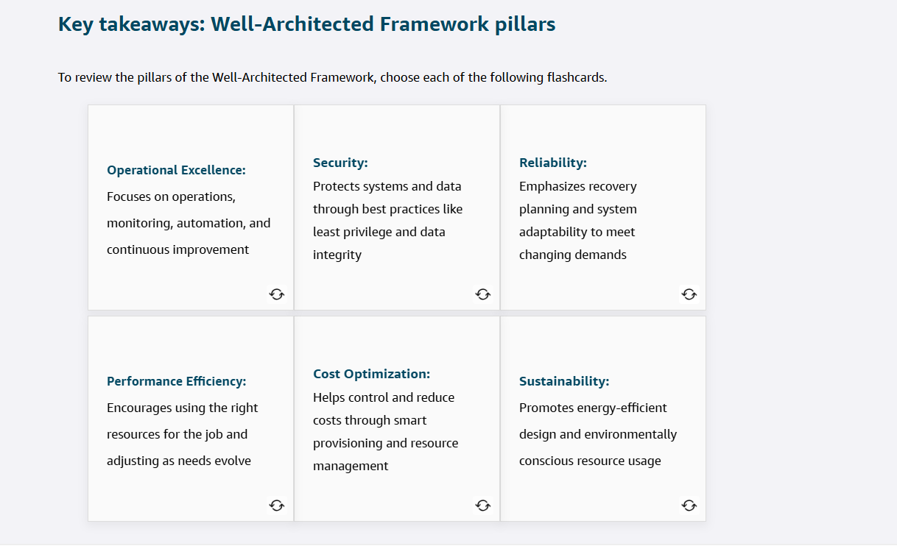

# AWS Well-Architected Framework – 6 Pillars
**C. AWS Well-Architected Tool**

It lets you **model workloads** via questionnaires, **review architecture** against the AWS Well-Architected Framework pillars, and provides **automated best practice checks** with prioritized improvement recommendations.

| Pillar | Focus | Key Points | Trick |
|:--|:--|:--|:--|
| **1️⃣ Operational Excellence** | Run & monitor systems | Automate changes, respond to events, continuous improvement | *“Operate & improve.”* |
| **2️⃣ Security** | Protect data & systems | Least privilege, encryption, monitoring, IAM | *“Lock it down.”* |
| **3️⃣ Reliability** | Ensure workloads recover | Fault tolerance, redundancy, backups | *“Recover fast.”* |
| **4️⃣ Performance Efficiency** | Use resources effectively | Right-sizing, autoscaling, caching | *“Do more with less.”* |
| **5️⃣ Cost Optimization** | Avoid unnecessary cost | Pay-as-you-go, monitor usage, reserved instances | *“Spend smart.”* |
| **6️⃣ Sustainability** | Minimize environmental impact | Use efficient resources, reduce waste | *“Go green with compute.”* |

### Markdown Preview mode
*Ctrl + Shift + V*

There are six design principles for operational excellence in the cloud:
* Perform operations as code
* Annotate documentation
* Make frequent, small, reversible changes
* Refine operations procedures frequently
* Anticipate failure
* Learn from all operational failures