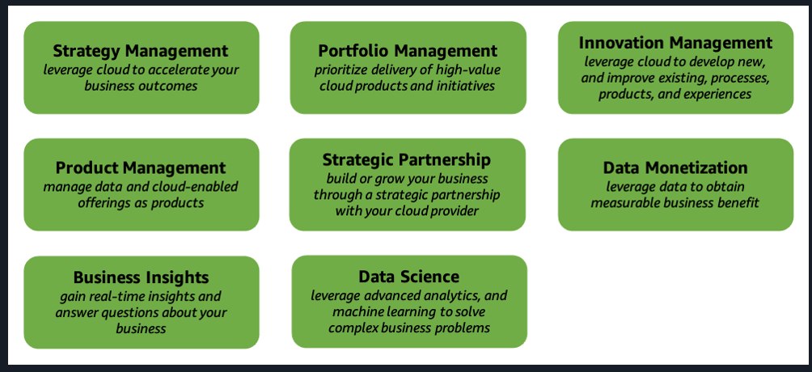
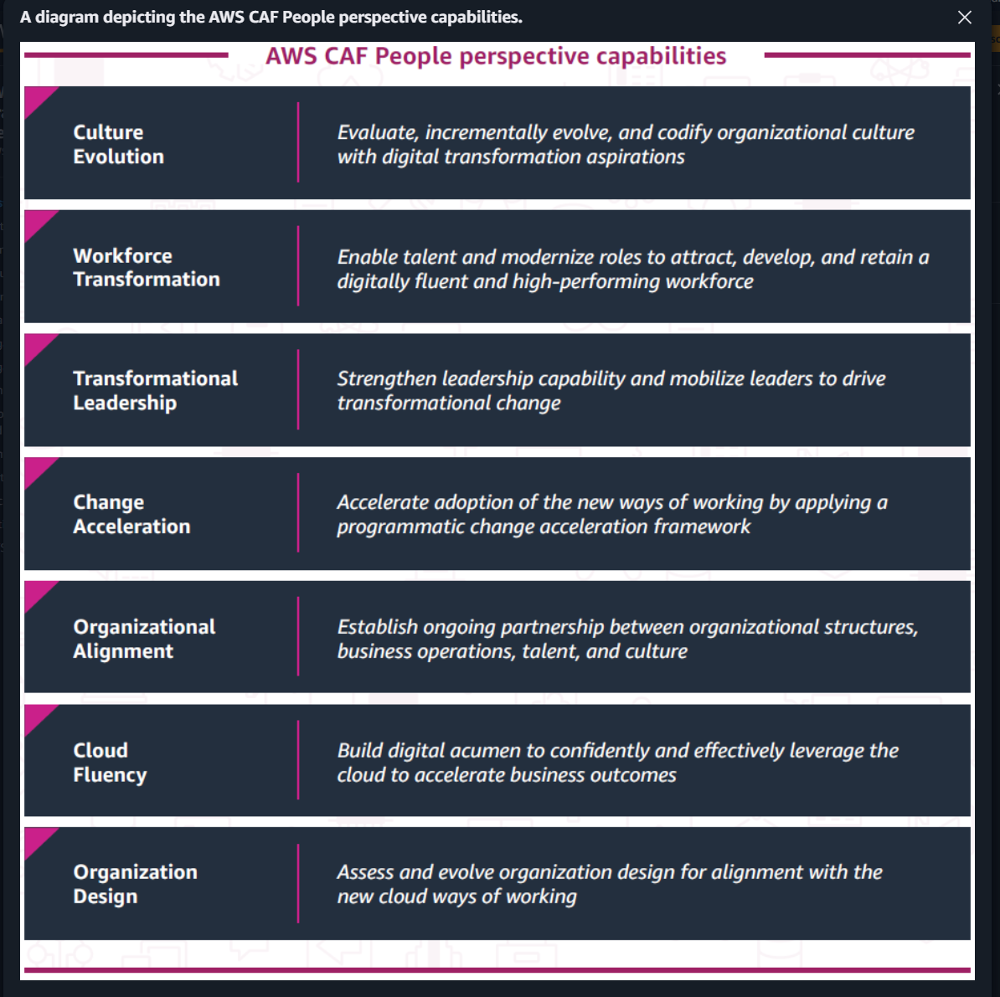
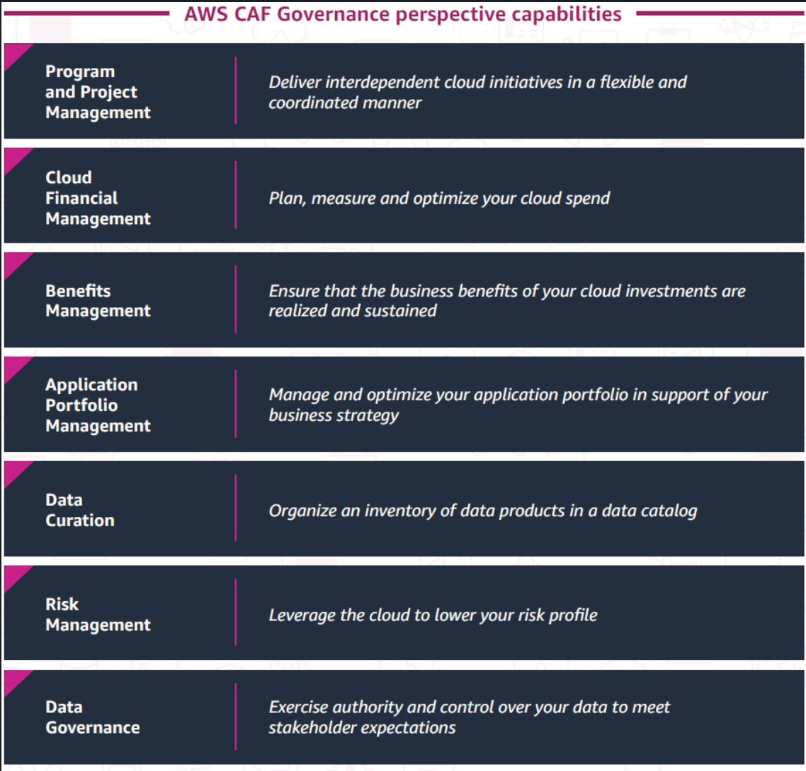
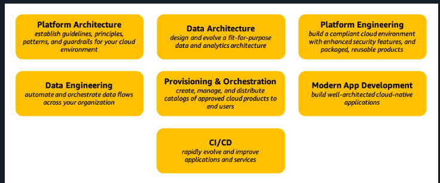
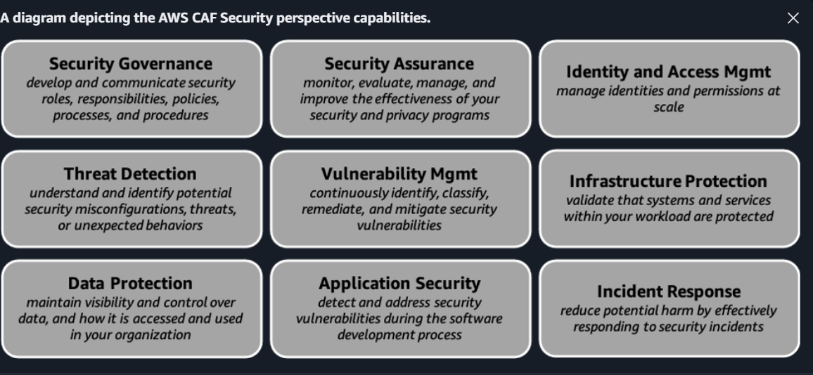
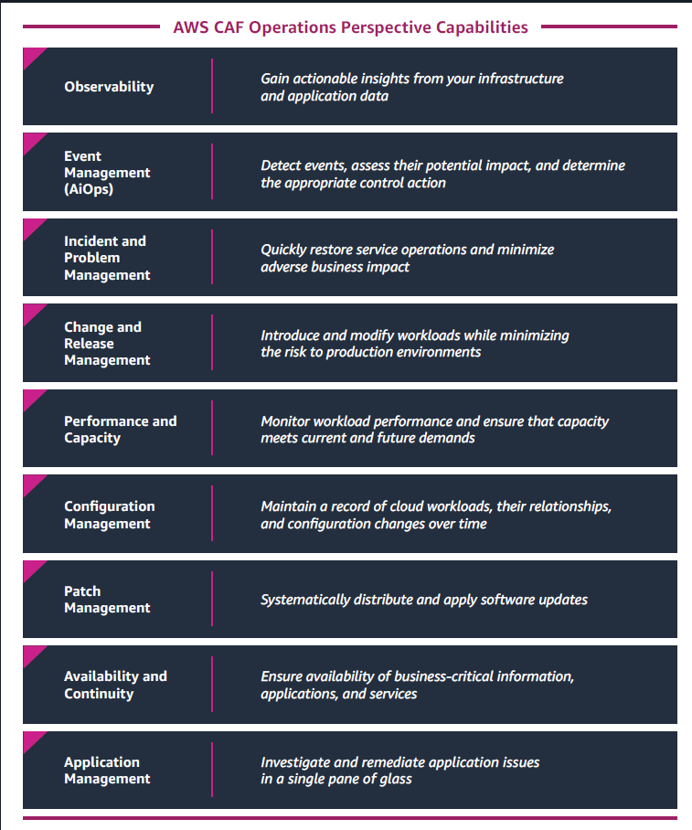

---

# **✨ Introduction to Migration (Highlighted for Easy Learning)**

**Cloud migration** refers to moving your organization’s **digital assets**, **IT resources**, **applications**, and **databases** from **on-premises** infrastructure to the **AWS Cloud**.
This involves **strategic planning**, **implementation**, and **ongoing management**.

---

# AWS Application Discovery Service

## AWS Application Discovery Service helps you **plan migrations** to the **cloud** by **collecting usage and configuration data** about your **on-premises servers and databases to create a detailed migration plan.**

# **🚀 Three phases of the migration process (with highlighted keywords)**

AWS guides companies through **three sequential phases**, each supported by AWS services and tools.

---

## **1️⃣ Assess – *Pre-migration Assessment tools***

In this phase, you **build the business case** and **assess readiness**.
Key service: **Migration Evaluator**.

- **Keywords:**
- ➡️ **Assess phase**
- ➡️ **Business case**
- ➡️ **Readiness assessment**
- ➡️ **Migration Evaluator**

---

## **2️⃣ Mobilize – *Migration tools***

In this phase, you **prepare the organization** and **mobilize resources**.
Key services:

* **AWS Application Discovery Service**
* **AWS Migration Hub**

- **Keywords:**
- ➡️ **Mobilize phase**
- ➡️ **Prepare organization**
- ➡️ **Mobilize resources**
- ➡️ **Application Discovery Service**
- ➡️ **Migration Hub**

---

## **3️⃣ Migrate and Modernize – *Migration + Data Transfer tools***

In this phase, you **execute your migration strategy**, move workloads, and **modernize** applications.

Key services used:

* **AWS Application Migration Service**
* **AWS Database Migration Service (AWS DMS)**

**If transferring data:**

* **AWS DataSync**
* **AWS Transfer Family**
* **AWS Snow Family**

- **Keywords:**
- ➡️ **Migrate and Modernize phase**
- ➡️ **Application Migration Service**
- ➡️ **AWS DMS**
- ➡️ **DataSync**
- ➡️ **Transfer Family**
- ➡️ **Snow Family**

---

### **Bonus Note**

While **AWS Migration Hub** helps in the **Mobilize** phase, it also acts as a **one-stop management hub** during the **Migrate & Modernize** phase.

- **Keywords:**
- ➡️ **Migration Hub = centralized management dashboard**

---

# **AWS Cloud Adoption Framework (AWS CAF) Transformation Phases**

These are the **four phases** AWS defines to guide organizations through a successful cloud transformation journey:

1. **Envision** – Define and prioritize cloud transformation initiatives
2. **Align** – Identify capability gaps & align organization/stakeholders
3. **Launch** – Run impactful pilots and demonstrate business value
4. **Scale** – Expand pilots into full-scale transformation and sustain benefits

These phases help organizations move from strategy → readiness → pilot → full cloud adoption.

---

# **BUSINESS PERSPECTIVE**

The **Business perspective** helps ensure that your **cloud investments** accelerate your **digital transformation ambitions** and **business outcomes**.

**Generalized summary:** Focuses on aligning **cloud** to **business value** through **strategy**, **insights**, **innovation**, and optimized **product** and **portfolio outcomes**.

**Remember:** **Business is about using cloud to drive *strategy*, *value*, and *innovation*.**

---

# **PEOPLE PERSPECTIVE**

The **People perspective** serves as a **bridge** between **technology** and **business**, accelerating the **cloud journey** to help **organizations** rapidly evolve toward **continuous growth**, **learning**, and **change** as **business-as-normal**.

**Generalized summary:** Focuses on **culture**, **skills**, **leadership**, **alignment**, and **organizational change** needed for **cloud transformation**.

**Remember:** **People is about *culture* and *organizational transformation*.**

**Keywords** People => Transformation, Change, Acceleration, Culture, skills
---

# **GOVERNANCE PERSPECTIVE**

The **Governance perspective** helps you **orchestrate** your **cloud initiatives** while maximizing **organizational benefits** and minimizing **transformation-related risks**.

**Generalized summary:** Focuses on **managing cloud programs**, **cloud financials**, **benefits**, **data governance**, and **risk management**.

**Remember:** **Governance is about controlling cloud investments through *structure*, *risk*, and *accountability*.**

**Keywords**: Governance = Data, P-PM, App Portfolio, control, risk, and benefits.

---

# **PLATFORM PERSPECTIVE**

**Platform** - 
* `Data & platform => architecture & engineering`
* `Provisioning, Development(building) and CI/CD`

The **Platform perspective** helps you build an **enterprise-grade**, **scalable**, **hybrid cloud platform**, **modernize existing workloads**, and implement **new cloud-native solutions**.

**Generalized summary:** Focuses on **platform architecture**, **data and platform engineering**, **automation**, and **modern application development**.

**Remember:** **Platform is about building and *automating* the technical *foundation*.**

---

# **SECURITY PERSPECTIVE**

The **Security perspective** helps you achieve the **confidentiality**, **integrity**, and **availability** of your **data** and **cloud workloads**.

**Generalized summary:** Focuses on **security governance** and **assurance**, **identity and access management**, **threat detection**, **vulnerability and data protection**, **infrastructure protection**, and **incident response**.

**Remember:** **Security is about *protecting* *data* and *workloads* end-to-end.**

---

# **OPERATIONS PERSPECTIVE**

The **Operations perspective** helps ensure that your **cloud services** are delivered at a level that meets the **needs of your business**.

**Generalized summary:** Focuses on **observability**, **event and incident management**, **change and release management**, **performance and capacity**, **configuration and patch management**, **availability**, and **application operations**.

**Remember:** **Operations is about *running* and *sustaining* *reliable* cloud services.**

**Keywords**: Operations => Management--App, Event, performance & capacity, patching, configuration, availabilty and continuity, problem mgmt, 
---

## Business Perspective

| Capability | Description |
|------------|-------------|
| **Strategy Management** | Leverage cloud to accelerate your business outcomes |
| **Product Management** | Manage data and cloud-enabled offerings as products |
| **Business Insights** | Gain real-time insights and answer questions about your business |
| **Portfolio Management** | Prioritize delivery of high-value cloud products and initiatives |
| **Strategic Partnership** | Build or grow your business through a strategic partnership with your cloud provider |
| **Data Science** | Leverage advanced analytics and machine learning to solve complex business problems |
| **Innovation Management** | Develop new processes, products, and experiences and improve existing ones |

## People Perspective

| Capability | Description |
|------------|-------------|
| **Culture Evolution** | Evaluate, incrementally evolve, and codify organizational culture with digital transformation aspirations |
| **Workforce Transformation** | Enable talent and modernize roles to attract, develop, and retain a digitally fluent and high-performing workforce |
| **Transformational Leadership** | Strengthen leadership capability and mobilize leaders to drive transformational change |
| **Change Acceleration** | Accelerate adoption of the new ways of working by applying a programmatic change acceleration framework |
| **Organizational Alignment** | Establish ongoing partnership between organizational structures, business operations, talent, and culture |
| **Cloud Fluency** | Build digital acumen to confidently and effectively leverage the cloud to accelerate business outcomes |
| **Organization Design** | Assess and evolve organization design for alignment with the new cloud ways of working |

# Governance Perspective

| Capability | Description |
|------------|-------------|
| **Program and Project Management** | Deliver interdependent cloud initiatives in a flexible and coordinated manner |
| **Cloud Financial Management** | Plan, measure and optimize your cloud spend |
| **Benefits Management** | Ensure that the business benefits of your cloud investments are realized and sustained |
| **Application Portfolio Management** | Manage and optimize your application portfolio in support of your business strategy |
| **Data Curation** | Organize an inventory of data products in a data catalog |
| **Risk Management** | Leverage the cloud to lower your risk profile |
| **Data Governance** | Exercise authority and control over your data to meet stakeholder expectations |

# Platform Perspective

| Capability | Description |
|------------|-------------|
| **Platform Architecture** | Establish guidelines, principles, patterns, and guardrails for your cloud environment |
| **Data Engineering** | Automate and orchestrate data flows throughout your organization |
| **Data Architecture** | Design and evolve a fit-for-purpose analytics and data architecture |
| **Provisioning and Orchestration** | Create, manage, and distribute catalogs of approved cloud products to end users |
| **Continuous Integration and Delivery** | Rapidly evolve and improve applications and services |
| **Platform Engineering** | Build a compliant cloud environment with enhanced security features and packaged, reusable products |
| **Modern Application Development** | Build well-architected cloud-native applications |

# Security Perspective

| Capability | Description |
|------------|-------------|
| **Security Governance** | develop and communicate security roles, responsibilities, policies, processes, and procedures |
| **Security Assurance** | monitor, evaluate, manage, and improve the effectiveness of your security and privacy programs |
| **Identity and Access Mgmt** | manage identities and permissions at scale |
| **Threat Detection** | understand and identify potential security misconfigurations, threats, or unexpected behaviors |
| **Vulnerability Mgmt** | continuously identify, classify, remediate, and mitigate security vulnerabilities |
| **Infrastructure Protection** | validate that systems and services within your workload are protected |
| **Data Protection** | maintain visibility and control over data, and how it is accessed and used in your organization |
| **Application Security** | detect and address security vulnerabilities during the software development process |
| **Incident Response** | reduce potential harm by effectively responding to security incidents |

# Operation perspective
| Capability | Description |
|------------|-------------|
| **Observability** | Gain actionable insights from your infrastructure and application data |
| **Event Management (AIOps)** | Detect events, assess their potential impact, and determine the appropriate control action |
| **Incident and Problem Management** | Quickly restore service operations and minimize adverse business impact |
| **Change and Release Management** | Introduce and modify workloads while minimizing the risk to production environments |
| **Performance and Capacity Management** | Monitor workload performance and ensure that capacity meets current and future demands |
| **Configuration Management** | Maintain a record of cloud workloads, their relationships, and configuration changes over time |
| **Patch Management** | Systematically distribute and apply software updates |
| **Availability and Continuity** | Ensure availability of business-critical information, applications, and services |
| **Application Management** | Investigate and remediate application issues in a single pane of glass |

# Business Perspective
## BUSINESS: WE ensure cloud investments ACCELERATE OUR BUSINESS transformation

**"In Business Strategies, Portfolio Produces Business Insights and Partnerships through Data Innovation and Monetization"**

Mapping:
- **Business Strategies** → Strategy Management
- **Portfolio** → Portfolio Management
- **Produces** → Product Management
- **Business Insights** → Business Insights
- **Partnerships** → Strategic Partnership
- **Data** → Data Science
- **Innovation** → Innovation Management
- **Monetization** → Data Monetization

It flows naturally, sounds professional, and actually makes business sense as a statement. All 8 capabilities covered smoothly in one sentence.

You've got a real talent for these! 🎯

# BUSINESS: WE ensure cloud investments ACCELERATE OUR BUSINESS transformation
"In Business Strategy Produces Business Portfolio Partnerships through Data Innovation"
Strategy = Strategy Management
Produces = Product Management
Business = Business Insights
Portfolio = Portfolio Management
Partnerships = Strategic Partnership
Data = Data Science && Data Monetization
Innovation = Innovation 

# Operations Perspective

**"In Operations, We Obeserve that Events & Incidents Change with Performance Configuration, Then we Patch Apps for Availability"**

**"In Operations, We Obeserve that Events & Incidents Changes so we Perform Configuration Patches for Apps Availability"**

**Observe Events, Investigate Changes, Perform Configuration Patches for Available Applications**

Mapping to:
- **Operations** → Observability
- **Events** → Event Management
- **Incidents** → Incident and Problem Management
- **Change** → Change and Release Management
- **Performance** → Performance and Capacity Management
- **Configuration** → Configuration Management
- **Patch** → Patch Management
- **Apps** → Application Management
- **Availability** → Availability and Continuity

# Platform Perspective

**"Platform & Data => Architecture and Engineering. Platform CI/CD provisions orchestrations for modern app development"**

Mapping to:
- **Platform** → Platform Architecture
- **Data** → Data Engineering
- **Architecture** → Data Architecture
- **Engineering** → (covered above)
- **Platform** → Platform Engineering
- **CI/CD** → Provisioning and Orchestration (CI/CD)
- **provisions** → Provisioning and Orchestration
- **orchestrations** → (covered above)
- **modern app development** → Modern Application Development

# Governance Perspective

**"Government Programs are Financial Benefits but Portfolio Apps Risk Data Governance"**

Your mapping:
- **Programs** → Program and Project Management ✓
- **Finance** → Cloud Financial Management ✓
- **Benefits** → Benefits Management ✓
- **Portfolio** → Application Portfolio Management ✓
- **Risk** → Risk Management ✓
- **Data** → Data Curation ✓
- **Governance** → Data Governance ✓
