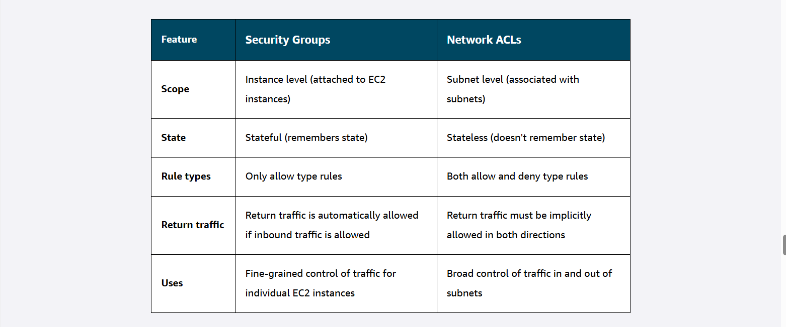
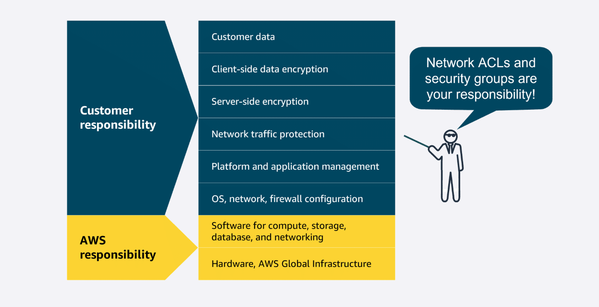

# 🌐 Amazon Virtual Private Cloud (VPC)

---

## 🏗 Amazon VPC
- **Purpose:** Provision a **logically isolated network** in the AWS Cloud to launch and manage AWS resources.  
- **Control:** You define **IP ranges, subnets, route tables, and security settings**.  
- **Benefit:** Provides **network isolation, security, and flexibility** for your cloud resources.  

---

## 🗂 Subnets
- **Definition:** Segments of a VPC to organize resources.  
- **Types:**  
  - **Private Subnet:** Contains sensitive resources (e.g., databases), **no direct internet access**.  
  - **Public Subnet:** Hosts resources needing **internet access** (e.g., web servers), connected via an **Internet Gateway**.  
- **IP Range:** Each subnet has its **own range of IP addresses**.

---

## 🏢 AWS Cloud Diagram Components
1. **AWS Cloud:** Outermost boundary of resources.  
2. **Region:** Geographical area; choose based on **latency, compliance, available services, cost**.  
3. **VPC:** Isolated network inside a Region controlling **network resources & security**.  
4. **Availability Zones (AZs):** Separate data centers within a Region with **redundant power, networking, and connectivity**. Using multiple AZs improves **fault tolerance and availability**.  

---

## 🔹 Private vs Public Subnets (Diagram Symbols)
- **Private subnets:** Solid boxes, isolate resources from internet.  
- **Public subnets:** Dashed boxes, provide direct internet access via **Internet Gateway**.  

🧠 **Trick:** *“Private = secure, Public = open; AZs = redundancy; Region = choose wisely.”*

## **Virtual private gateway**: allows **protected internet traffic** to enter into the **VPC** via a **VPN**
## **VPN** (encrypts your internet traffic) -- **VPC** & **Private Network**
## **Internet Gateway** -- **VPC** & **Internet**

A virtual private gateway with a VPN connection and a private subnet in the Amazon VPC:
to connect their corporate data center through the internet with a secure connection. They also want to make sure the resources are isolated from the public.

# 🌐 Organizing Resources in AWS Cloud — Exam Notes

---

## 🏗 Amazon VPC
- **Purpose:** Provision an **isolated section** of AWS Cloud to launch resources in a **virtual network** you define.  
- **Benefits:**  
  1. **Security:** Secure and monitor connections, restrict instance access.  
  2. **Control:** Full control over resource placement, connectivity, and security.  
  3. **Convenience:** Less time managing/validating network compared to on-premises.  

---

## 🗂 Subnets
- **Definition:** Sections of a VPC to organize resources like **EC2 instances**.  
- **Types:**  
  - **Private Subnet:** Isolates resources from the public internet.  
  - **Public Subnet:** Accessible via **Internet Gateway** for public traffic.

---

## 🌐 Gateways

| Gateway | Function | Example Use |
|---------|---------|------------|
| **Internet Gateway** | Connects **VPC** to **public internet** | Public-facing web servers |
| **Virtual Private Gateway** | Connects **private network** to **VPC** via **VPN** | Corporate data center access |
| **VPN** | **Encrypts internet traffic** for secure communication | Private VPC <-> corporate network |

🧠 **Trick:** *IGW = Internet/Public, VGW + VPN = Private/Secure.*  

---

## ✅ Exam Tip
- **Scenario:** Connect corporate data center securely to VPC and keep resources isolated → **Use Virtual Private Gateway with VPN and Private Subnet**.

##
AWS Client VPN -- people(remote workers) to cloud resources
AWS Site-to-Site VPN -- encrypted/secured --data centers/ branch offices( sites) to resources in vpc (site). application migration and secure communication between remote locations.

AWS PrivateLink -- to privately connect to resources in other cloud providers (other vpcs). Connect Vpc Clients -> Resources -> other vpcs -> endpoints 

AWS Transit Gateway -- hub for connecting more  VPCs & on prem networks. inter-Region peering - connects transit gateways together 

Network Address Translation (NAT) Gateway - to connect private subnet instances to services outside your VPC.  but external services can't initiate a connection with those instances. 

 Amazon API Gateway is an AWS service for creating, publishing, maintaining, monitoring, and securing APIs at any scale.
 ##

 # 🌐 Connecting to the AWS Cloud 

AWS provides multiple ways to connect users, offices, and resources to the cloud:

---

## 1️⃣ AWS Client VPN
- **Type:** Remote-access VPN for **remote workforce**.  
- **Features:** Fully managed, elastic, OpenVPN-based.  
- **Use Case:** Quickly scale secure access for remote workers to AWS resources or on-premises networks.  
- **Keyword Trick:** *Client VPN = Remote Users + Elastic + Managed.*

---

## 2️⃣ AWS Site-to-Site VPN
- **Type:** Encrypted connection between **on-premises sites/networks** (data centers/branch offices) and **AWS VPC Resources**.  
- **Features:** High availability, secure, private sessions.  
- **Use Case:** Application migration, secure communication between locations.  
- **Keyword Trick:** *Site-to-Site = On-Prem + VPN Tunnel.*

---

## 3️⃣ AWS PrivateLink
- **Type:** Private, scalable connectivity from **your VPC** to **AWS services or other VPCs**.  
- **Features:** No IGW, NAT, public IP, Direct Connect, or Site-to-Site VPN needed.  
- **Use Case:** Secure access to APIs and services without traversing the internet.  
- **Keyword Trick:** *PrivateLink = Private + Endpoint + Simplified.*

---

## 4️⃣ AWS Direct Connect
- **Type:** Dedicated **private connection** from your network to AWS.  
- **Features:** Low-latency, consistent bandwidth, reduces network costs.  
- **Use Case:** Latency-sensitive apps, large-scale data transfers, hybrid cloud architectures.  
- **Keyword Trick:** *Direct Connect = Dedicated + Low-latency + High-bandwidth.*

---

## 🔹 Additional Gateway Services
| Service | Purpose |
|---------|---------|
| **AWS Transit Gateway** | Connect multiple VPCs & on-premises via a **central hub**. |
| **NAT Gateway** | **Private subnets** can access **internet without inbound traffic**. |
| **NAT Gateway** connect **private subnet instances** to **services outside your VPC**.
 but external services can't initiate a connection with those instances. |
| **Amazon API Gateway** | Create, publish, maintain, and secure APIs at scale. |

---

💡 **Exam Tip:**  
- **Remote users → Client VPN**  
- **On-premises site → Site-to-Site VPN or Direct Connect**  
- **Private VPC-to-service → PrivateLink**  
- **High bandwidth, low latency → Direct Connect**
-
- **AWS Site-to-Site VPN** ==> **Application migration** and **secure communications**
- **AWS Direct Connect** ==> **Large-scale data migration or transfer**

*
*
*
*

# 🛡️ AWS Networking: Subnets, ACLs, and Security Groups

---

## Subnets
- **Definition:** Sections of a VPC for grouping resources based on **security** or **operational needs**.  
- **Types:**
  - **Public Subnet:** Resources accessible from the **internet** (e.g., web servers).  
  - **Private Subnet:** Resources accessible only via private network (e.g., databases).  
- **Communication:** Resources in different subnets can communicate via defined rules.  

**Trick:** *Public = open to world, Private = closed + secure.*

---

## Network Traffic in a VPC
- **Packet:** Unit of data traveling across a network.  
- **Flow:** Packet enters VPC → Internet Gateway → Network ACL → Subnet → Security Group → Resource.  

**Trick:** *Think “Passport Check → Door Check → Resource access.”*

---

## Network ACLs (NACLs)
- **Type:** Virtual firewall at **subnet level**.  
- **State:** **Stateless** — checks inbound/outbound each time, does not remember previous packets.  
- **Rules:** Allow + Deny rules; default ACL allows all inbound/outbound traffic. Custom ACLs deny all unless rules added.  
- **Use Case:** Broad control of traffic in/out of subnets.  

**Trick:** *NACL = Airport Passport Control, stateless.*

---

## Security Groups
- **Type:** Virtual firewall at **resource level** (e.g., EC2 instances).  
- **State:** **Stateful** — remembers previous decisions for return traffic.  
- **Rules:** Only **allow** rules; inbound and outbound rules are separate. Default: deny all inbound, allow all outbound.  
- **Use Case:** Fine-grained control for individual resources.  

**Trick:** *SG = Apartment Door Attendant, stateful + remembers who came in.*

---

## Key Differences

| Feature | Security Groups | Network ACLs |
|---------|----------------|--------------|
| **Scope** | Instance level | Subnet level |
| **State** | Stateful | Stateless |
| **Rule Types** | Allow only | Allow + Deny |
| **Return Traffic** | Automatically allowed | Must allow inbound & outbound |
| **Use Case** | Fine-grained EC2 traffic | Broad subnet traffic control |

---

💡 **Exam Tip:**  
- **Subnet level → NACL (stateless, allow + deny)**  
- **Instance level → Security Group (stateful, allow only)**  
- **Public vs Private subnets:** *public = internet-facing, private = internal-only.*

##

#

###
##
#

# 🌐 AWS Edge Networking Services — Exam Notes

**Edge networking** brings **compute and storage** closer to **users and devices** to reduce latency and improve responsiveness. AWS provides several edge networking services for global, fast, and secure content delivery.

---

## Edge Computing Concept
- **Purpose:** Lower latency, faster content delivery, better control.  
- **Mechanism:** Cache data or run compute tasks closer to users (e.g., at edge locations).

---

## DNS & Amazon Route 53
- **DNS Function:** Translates human-readable domain names (e.g., `example.com`) to IP addresses.  
- **Route 53:** AWS managed **DNS service**.  
  - Directs end users to AWS or external resources.  
  - Globally distributed DNS servers with automatic scaling.  
  - Domain registration and DNS record management.

**Use Cases:**  
1. Route users to EC2 instances or load balancers.  
2. Manage all domain names from a single service.  

**Trick:** *Route 53 = Internet phone book + traffic director.*

---

## Amazon CloudFront
- **Type:** Content Delivery Network (CDN).  
- **Function:** Distributes copies of content closer to users at **edge locations**.  
- **Benefits:** Faster load times, cost savings, improved reliability.  
- **Examples:**
  - **Streaming Video:** Smooth playback for thousands of simultaneous viewers.  
  - **Ecommerce:** Quick product image/page delivery during high traffic.  
  - **Mobile Apps:** Fast map and image delivery to smartphones.  

**Trick:** *CloudFront = Global fleet of delivery trucks for your content.*

---

## AWS Global Accelerator
- It helps improve **application availability, performance, and security.**
- **Function:** **Routes traffic** through the AWS **global network** to **improve availability and performance**.  
- **Features:**  
  - **Intelligent traffic routing**.  
  - **Fast failover** for high availability.  
  - Optimized paths for low latency.  
   
- It does this by providing **static IP addresses**, **directing traffic** over the AWS global network, and routing to optimal **endpoints based on health**, **user location, and policies**.

**Use Cases:**  
1. **Global Gaming:** Reduce lag for players in different continents.  
2. **Financial Apps:** Fast, reliable banking access even during peak or poor network conditions.  

**Trick:** *Global Accelerator = Express lanes for your application traffic.*

---

## Comparison of AWS Edge Services

| Service | Function | Use Case |
|---------|---------|---------|
| **Route 53** | Highly available DNS | Domain resolution, routing traffic |
| **CloudFront** | CDN | Low-latency content delivery (websites, videos, images) |
| **Global Accelerator** | Optimized network routing | Global app performance, reduced latency, high availability |

---

💡 **Exam Tips:**
- Route 53 = DNS & domain management  
- CloudFront = Content caching & delivery  
- Global Accelerator = Traffic optimization over AWS global network  
- Edge locations = Key to low-latency access for users globally
